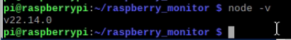
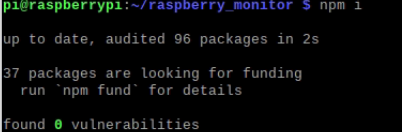
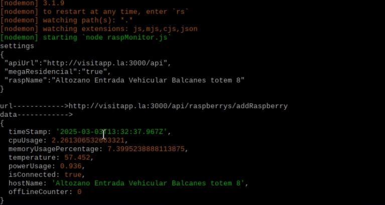
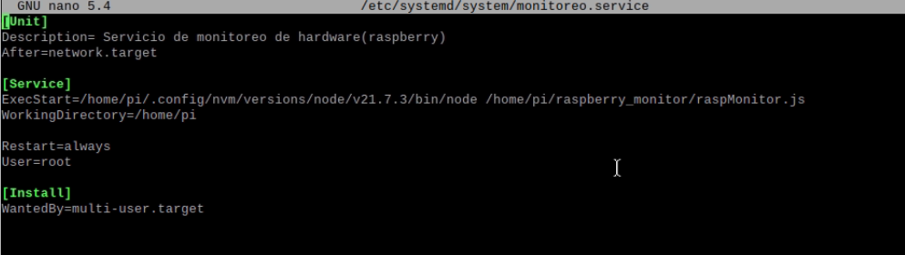
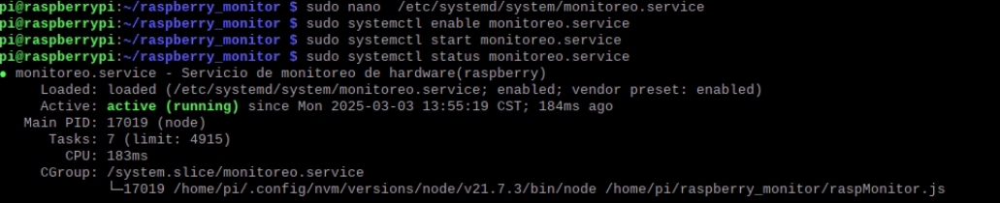
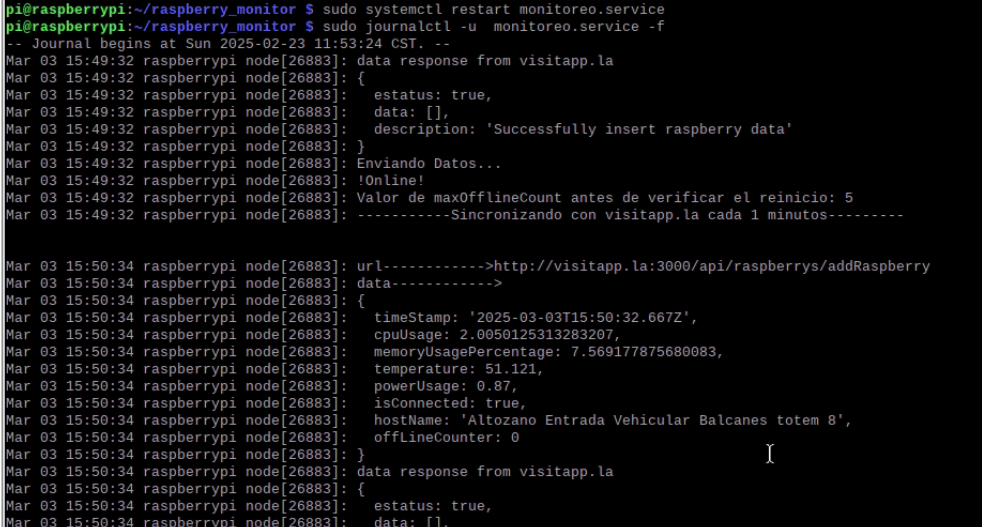

# Configuracion para correr servicio de monitoreo en las raspberrys


## Instalaciones necesarias

1. __Node js (16 o superior)__
2. __Npm (10 o superior)__

 * Comando para instalar nvm (node vesion manager)
```
# Download and install nvm:
curl -o- https://raw.githubusercontent.com/nvm-sh/nvm/v0.40.1/install.sh | bash

# in lieu of restarting the shell
\. "$HOME/.nvm/nvm.sh"

# Download and install Node.js:
nvm install 22

# Verify the Node.js version:
node -v # Should print "v22.14.0".
nvm current # Should print "v22.14.0".

# Verify npm version:
npm -v # Should print "10.9.2".

```

### Verificamos que la instalacion fue exitosa con el comando node -v



## Archivos necesarios
    1.pi_settings.js
    2.raspMonitor.js
    3.package.json


## Pasos a seguir
1. Instalacion de dependencias __para eso es necesario tener el package.json y node js instalado__ 

```
npm install
```



2. para correr en desarrollo, utilizaremos el siguiente comando

```
npm run dev
```


## Listo
 ### deberias poder visualizar algo como esto:
   


## Creamos el servicio monitoreo.service

 ### 
1. Creamos el archivo de servicio 
```
sudo nano /etc/systemd/system/monitoreo.service
```
2. pegamos el siguiente codigo  
```
[Unit]
Description= Servicio de monitoreo de hardware(raspberry)
After=network.target

[Service]
ExecStart=/home/pi/.config/nvm/versions/node/v21.7.3/bin/node /home/pi/raspberry_monitor/raspMonitor.js
WorkingDirectory=/home/pi

Restart=always
User=root

[Install]
WantedBy=multi-user.target
```



Guardamos...

Esta debe ser la ruta de donde tienes instalado node js, __"por lo que puede llegar a cambiar"__<span style="color:red;">/home/pi/.config/nvm/versions/node/v21.7.3/bin/node</span>.

## Mostramos, Iniciamos y verificamos el esattus del servicio

    1. Mostramos

    ```
    sudo systemctl enable monitoreo.service
    ```
    2. Iniciamos

    ```
    sudo systemctl start monitoreo.service
    ```
    3. Verificamos estatus

    ```
    sudo systemctl status monitoreo.service
    ```

 ### Deberiamos ver algo como esto
 


### Con el siguiente comando podemos revisar si hicimos todos bien
```
sudo journalctl -u monitoreo.service -f
```


 


